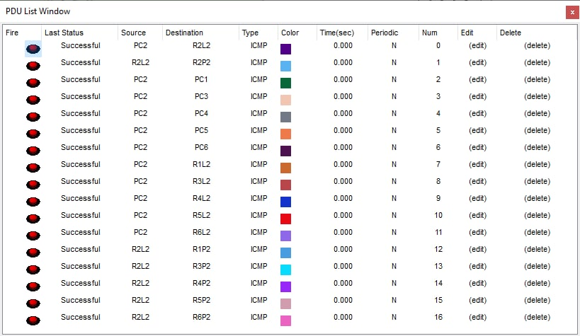

# ABC Hut Network Design
Network Design for ABC Hut, Floor 31

## A. Project Design Description

The increase in the number of overseas and nearby provinces enrollees in ABC School paved the way for the planning of constructing a 47-story condominium unit. This building, ABC Hut, will consist of various facilities and amenities. These would include parking, an amusement center, cafes, recreational hubs, a chapel, a swimming pool, laundry, medical and dental clinics, a spa, and the rest are studio-type rooms. With this plan, it cannot be completed without a network plan for each floor and facility as all floors are planned to be internet-ready both wired and wireless.

In this paper, the assignment is floor 31 which consists of six (6) studio-type rooms, each accommodating four (4) students. Considering the number of rooms, each will have its own Local Area Network (LAN), and the connections are available wired and wirelessly (WLAN).

To achieve an efficient yet cost-effective connection, the network design would include a router, switches, a hub, access points, and cables. Using one router with high bandwidth can handle all rooms for the assigned floor. This can potentially maximize the connections in the router. With this concept, it also aims to consider the possible additional number of connections, which will depend on the materials and devices used in setting up the network. The use of a hub and access points is to minimize the possible cost while maximizing an efficient connection.

## B. Design Materials and Costing

The network design plan is applicable for six rooms with a designated LAN for each room in floor 31. The chosen components are ready for possible additional connections, wired or wirelessly to achieve scalability. With this, the table that follows shows the proposed materials, its quantity, the cost, and the overall total for the network design.

| Item No. | Materials | Quantity | Cost | Total |
|---|---|---|---|---|
| 1 | Router | 1 | 42,258.24 | 42,258.24 |
| 2 | Hub | 1 | 1,157.76 | 1,157.76 |
| 3 | Switch | 6 | 20,260.80 | 121,564.80 |
| 4 | Access Point | 6 | 1,157.76 | 6,946.56 |
| 5 | Straight-through Cable (200ft) | 1 | 1797.81 | 3,595.62 |
| 6 | Crossover Cable (200ft) | 1 | 1855.82 | 3,711.64 |
| **Total** |  |  |  | **₱179,234.62** |

*[The cost of the materials is referenced from the Cisco Packet Tracer and C2G website in US Dollars converted to Philippine Peso as of November 09, 2022.]*

## C. Design Topology

The image above shows the logical layout planned for floor 31 of Animo Hut. The design topology of the network is Star Topology since it has a core or center node which branches out the connection until it reached the devices. With the layout of the network, a star topology can be spotted with the connection of the hub and the switches, the hub as the central node which is connected to the router. Another star network can be spotted with the access points as the devices are wirelessly connected to a central node. Looking at a bigger picture, the network topology of the design could also be considered as a Tree Topology. Given the idea that a tree topology, there is one central node, and each node are connected through a single path like branches of a tree. Since the devices are connected to only one router, then connected to a hub, followed by switches and access points, it can be viewed that it has different levels, and the last level are the host devices.

The following tables shows the summary of subnetting of the network used for floor 31. It also includes the network addresses, usable ranges, and broadcast addresses.

| IP Address | 192.168.10.1 |
|---|---|
| Network Address | 192.168.10.0 |
| IP Class | Class C [255.255.255.0] |
| Number of Hosts (Connected) | 54 |
| Total Possible Number of Hosts | 64 |
| Total Number of Usable Hosts | 62 |
| Total Number of Reserved Hosts | 2 |
| Binary Subnet Mask | 11111111.11111111.11111111.1100000000 |
| Subnet Mask | 255.255.255.192 /26 |

| Subnet Address | Host Address | Broadcast Address |
|---|---|---|
| 192.168.10.0 | 192.168.10.1 - 192.168.10.62 | 192.168.10.63 |
| 192.168.10.64 | 192.168.10.65 - 192.168.10.126 | 192.168.10.127 |
| 192.168.10.128 | 192.168.10.129 - 192.168.10.190 | 192.168.10.191 |
| 192.168.10.192 | 192.168.10.193 - 192.168.10.254 | 192.168.10.255 |

The table that follows shows the network devices used in the logical topology above, the device name, and the ports available, used, and for reserved.

| Device | Device Name | Ports |
|---|---|---|
| Hub | F31H1 | Port 1 [Fa0] : F31RT1 [Gig0/1] Port 2 [Fa1] : R1S1 [Fa0/1] Port 3 [Fa2] : R2S1 [Fa0/1] Port 4 [Fa3] : R3S1 [Fa0/1] Port 5 [Fa4] : R4S1 [Fa0/1] Port 6 [Fa5] : R5S1 [Fa0/1] Port 7 [Fa6] : R6S1 [Fa0/1]   Ports 8 -10 [RESERVED] |
| Switch | F31H1 | Port 1 [Fa0/1]: F31RT1 [Fa1] Port 2 [Fa1/1]: R1S1 [Fa0] Port 3 [Fa2/1]: PC1 [Fa0] Ports 4-10 [RESERVED] |
| | R1S1 | Port 1 [Fa0/1]: F31RT1 [Fa1] Port 2 [Fa1/1]: F31R1 [Fa0] Port 3 [Fa2/1]: PC1 [Fa0] Ports 4-10 [RESERVED] |
| | R1S2 | Port 1 [Fa0/1]: F31RT1 [Fa2] Port 2 [Fa1/1]: F31R2 [Fa0] Port 3 [Fa2/1]: PC2 [Fa0] Ports 4-10 [RESERVED] |
| | R1S3 | Port 1 [Fa0/1]: F31RT1 [Fa3] Port 2 [Fa1/1]: F31R3 [Fa0] Port 3 [Fa2/1]: PC3 [Fa0] Ports 4-10 [RESERVED] |
| | R1S4 | Port 1 [Fa0/1]: F31RT1 [Fa4] Port 2 [Fa1/1]: F31R4 [Fa0] Port 3 [Fa2/1]: PC4 [Fa0] Ports 4-10 [RESERVED] |
| | R1S5 | Port 1 [Fa0/1]: F31RT1 [Fa5] Port 2 [Fa1/1]: F31R5 [Fa0] Port 3 [Fa2/1]: PC5 [Fa0] Ports 4-10 [RESERVED] |
| | R1S6 | Port 1 [Fa0/1]: F31RT1 [Fa6] Port 2 [Fa1/1]: F31R6 [Fa0] Port 3 [Fa2/1]: PC6 [Fa0] Ports 4-10 [RESERVED] |
| Access Point | F31R1 | Port 0 [PT-Repeater-NM-1CFE]: R1S1 [Fa1/1] Port 1 [Wireless] |
| | F31R2 | Port 0 [PT-Repeater-NM-1CFE]: R2S1 [Fa2/1] Port 1 [Wireless] |
| | F31R3 | Port 0 [PT-Repeater-NM-1CFE]: R3S1 [Fa2/1] Port 1 [Wireless] |
| | F31R4 | Port 0 [PT-Repeater-NM-1CFE] : R4S1 [Fa1/1] Port 1 [Wireless] |
| | F31R5 | Port 0 [PT-Repeater-NM-1CFE] : R5S1 [Fa1/1] Port 1 [Wireless] |
| | F31R6 | Port 0 [PT-Repeater-NM-1CFE] : R6S1 [Fa1/1] Port 1 [Wireless] |

The table below shows the Local Area Networks [LANs], device names, and IP addresses. The IP for the wired connection is static while DHCP for wireless which means there is no permanent IP address set for the wirelessly connected devices within the network.

| Device | Device Name | IP Address |
|---|---|---|
| Router | F31RT1 | Gig 0/0: 192.168.0.1 Gig 0/1: 192.168.10.1 |
| LAN 1 [Default Gateway:192.168.10.1 | PC1 | 192.168.10.10 |
|  | R1L1 | DHCP |
|  | R1L2 | DHCP |
|  | R1L3 | DHCP |
|  | R1L4 | DHCP |
|  | R1P1 | DHCP |
|  | R1P2 | DHCP |
|  | R1P3 | DHCP |
|  | R1P4 | DHCP |
| LAN 2 [Default Gateway:192.168.10.1] | PC2 | 192.168.10.20 |
|  | R2L1 | DHCP |
|  | R2L2 | DHCP |
|  | R2L3 | DHCP |
|  | R2L4 | DHCP |
|  | R2P1 | DHCP |
|  | R2P2 | DHCP |
|  | R2P3 | DHCP |
|  | R2P4 | DHCP |
| LAN 3 [Default Gateway:192.168.10.1] | PC3 | 192.168.10.30 |
|  | R2L1 | DHCP |
|  | R3L2 | DHCP |
|  | R3L3 | DHCP |
|  | R3L4 | DHCP |
|  | R3P1 | DHCP |
|  | R3P2 | DHCP |
|  | R3P3 | DHCP |
|  | R3P4 | DHCP |
| LAN 4 [Default Gateway:192.168.10.1] | PC4 | 192.168.10.40 |
|  | R4L1 | DHCP |
|  | R4L2 | DHCP |
|  | R4L3 | DHCP |
|  | R4L4 | DHCP |
|  | R4P1 | DHCP |
|  | R4P2 | DHCP |
|  | R4P3 | DHCP |
|  | R4P4 | DHCP |
| LAN 5 [Default Gateway:192.168.10.1] | PC5 | 192.168.10.50 |
|  | R5L1 | DHCP |
|  | R5L2 | DHCP |
|  | R5L3 | DHCP |
|  | R5L4 | DHCP |
|  | R5P1 | DHCP |
|  | R5P2 | DHCP |
|  | R5P3 | DHCP |
|  | R5P4 | DHCP |
| LAN 6 [Default Gateway:192.168.10.1] | PC6 | 192.168.10.60 |
|  | R6L1 | DHCP |
|  | R6L2 | DHCP |
|  | R6L3 | DHCP |
|  | R6L4 | DHCP |
|  | R6P1 | DHCP |
|  | R6P2 | DHCP |
|  | R6P3 | DHCP |
|  | R6P4 | DHCP |

## D. Testing & Results

The testing will take place using the Protocol Date Unit (PDU) unit. This method uses only cursors to ping the source and the desired destination. The testing will include router to selected devices from each LAN, devices to devices from same LAN and from different LANs. To ensure that the wireless and wired devices are connected to one another, the testing would also include pinging of these devices for each LAN. The table below summarizes the result of all the tests done for the network design for Floor 31.

| Source | Destination | Passed | Failed |
|---|---|---|---|
| Router | LAN 1: PC1 [192.168.10.10] | ✓ |  |
|  | LAN 1: R1L1 [DHCP] | ✓ |  |
|  | LAN 1: R1P1 [DHCP] | ✓ |  |
|  | LAN 2: PC2 [192.168.10.20] | ✓ |  |
|  | LAN 2: R2L1 [DHCP] | ✓ |  |
|  | LAN 2: R2P1 [DHCP] | ✓ |  |
| F31RT1 | LAN 3: PC3 [192.168.10.30] | ✓ |  |
|  | LAN 3: R3L1 [DHCP] | ✓ |  |
|  | LAN 3: R3P1 [DHCP] | ✓ |  |
|  | LAN 4: PC4 [192.168.10.40] | ✓ |  |
|  | LAN 4: R4L1 [DHCP] | ✓ |  |
|  | LAN 4: R4P1 [DHCP] | ✓ |  |
|  | LAN 5: PC5 [192.168.10.50] | ✓ |  |
|  | LAN 5: R5L1 [DHCP] | ✓ |  |
|  | LAN 5: R5P1 [DHCP] | ✓ |  |
|  | LAN 6: PC6 [192.168.10.60] | ✓ |  |
|  | LAN 6: R6L1 [DHCP] | ✓ |  |
|  | LAN 6: R6P1 [DHCP] | ✓ |  |
| **LAN 1** |  |  |  |
| PC1	| LAN 1: R1L1	| ✓ |
| R1L1	| LAN 1: R1P1	| ✓ | 
| PC1	| LAN 2: PC2	| ✓ | 
| PC1	| LAN 3: PC3	| ✓ | 
| PC1	| LAN 4: PC4	| ✓ | 
| PC1	| LAN 5: PC5	| ✓ | 
| PC1	| LAN 6: PC6	| ✓ | 
| PC1	| LAN 2: R2L1	| ✓ | 
| PC1	| LAN 3: R3L1	| ✓ | 
| PC1	| LAN 4: R4L1	| ✓ | 
| PC1	| LAN 5: R5L1	| ✓ | 
| PC1	| LAN 6: R6L1	| ✓ | 
| R1L1	| LAN 2: R2P1	| ✓ |
| R1L1	| LAN 3: R3P1	| ✓ |
| R1L1	| LAN 4: R4P1	| ✓ |
| R1L1	| LAN 5: R5P1	| ✓ |
| R1L1	| LAN 6: R6P1	| ✓ |
| **LAN 2** |  |  |  |
| PC2	| LAN 2: R2L2	| ✓ |
| R2L2	| LAN 2: R2P2	| ✓ |
| PC2	| LAN 1: PC1	| ✓ |
| PC2	| LAN 3: PC3	| ✓ |
| PC2	| LAN 4: PC4	| ✓ |
| PC2	| LAN 5: PC5	| ✓ |
| PC2	| LAN 6: PC6	| ✓ |
| PC2	| LAN 1: R1L2	| ✓ |
| PC2	| LAN 3: R3L2	| ✓ |
| PC2	| LAN 4: R4L2	| ✓ |
| PC2	| LAN 5: R5L2	| ✓ |
| PC2	| LAN 6: R6L2	| ✓ |
| R2L2	| LAN 1: R1P2	| ✓ |
| R2L2	| LAN 3: R3P2	| ✓ |
| R2L2	| LAN 4: R4P2	| ✓ |
| R2L2	| LAN 5: R5P2	| ✓ |
| R2L2	| LAN 5: R5P2	| ✓ |
| **LAN 3** |  |  |  |
| PC3	| LAN 3: R3L3	| ✓ |
| R3L3	| LAN 3: R3P3	| ✓ |
| PC3	| LAN 1: PC1	| ✓ |
| PC3	| LAN 2: PC2	| ✓ |
| PC3	| LAN 4: PC4	| ✓ |
| PC3	| LAN 5: PC5	| ✓ |
| PC3	| LAN 6: PC6	| ✓ |
| PC3	| LAN 1: R1L3	| ✓ |
| PC3	| LAN 2: R2L3	| ✓ |
| PC3	| LAN 4: R4L3	| ✓ |
| PC3	| LAN 5: R5L3	| ✓ |
| PC3	| LAN 6: R6L3	| ✓ |
| R3L3	| LAN 1: R1P3	| ✓ |
| R3L3	| LAN 2: R2P3	| ✓ |
| R3L3	| LAN 4: R4P3	| ✓ |
| R3L3	| LAN 5: R5P3	| ✓ |
| R3L3	| LAN 6: R6P3	| ✓ |
| **LAN 4** |  |  |  |
| PC4	| LAN 4: R4L4	| ✓ |
| R4L4	| LAN 4: R4P4	| ✓ |
| PC4	| LAN 1: PC1	| ✓ |
| PC4	| LAN 2: PC2	| ✓ |
| PC4	| LAN 3: PC3	| ✓ |
| PC4	| LAN 5: PC5	| ✓ |
| PC4	| LAN 6: PC6	| ✓ |
| PC4	| LAN 1: R1L4	| ✓ |
| PC4	| LAN 2: R2L4	| ✓ |
| PC4	| LAN 3: R3L4	| ✓ |
| PC4	| LAN 5: R5L4	| ✓ |
| PC4	| LAN 6: R6L4	| ✓ |
| R4L4	| LAN 1: R1P4	| ✓ |
| R4L4	| LAN 2: R2P4	| ✓ |
| R4L4	| LAN 3: R3P4	| ✓ |
| R4L4	| LAN 5: R5P4	| ✓ |
| R4L4	| LAN 6: R6P4	| ✓ |
| **LAN 5** |  |  |  |
| PC5	| LAN 5: R5L1	| ✓ |
| R5L1	| LAN 5: R5P1	| ✓ |
| PC5	| LAN 1: PC1	| ✓ |
| PC5	| LAN 2: PC2	| ✓ |
| PC5	| LAN 3: PC3	| ✓ |
| PC5	| LAN 4: PC4	| ✓ |
| PC5	| LAN 6: PC6	| ✓ |
| PC5	| LAN 1: R1L1	| ✓ |
| PC5	| LAN 2: R2L1	| ✓ |
| PC5	| LAN 3: R3L1	| ✓ |
| PC5	| LAN 4: R4L1	| ✓ |
| PC5	| LAN 6: R6L1	| ✓ |
| R5L1	| LAN 1: R1P1	| ✓ |
| R5L1	| LAN 2: R2P1	| ✓ |
| R5L1	| LAN 3: R3P1	| ✓ |
| R5L1	| LAN 4: R4P1	| ✓ |
| R5L1	| LAN 6: R6P1	| ✓ |
| **LAN 6** |  |  |  |
| PC6	| LAN 6: R6L3	| ✓ |
| R6L1	| LAN 6: R6P3	| ✓ |
| PC6	| LAN 1: PC1	| ✓ |
| PC6	| LAN 2: PC2	| ✓ |
| PC6	| LAN 3: PC3	| ✓ |
| PC6	| LAN 4: PC4	| ✓ |
| PC6	| LAN 5: PC5	| ✓ |
| PC6	| LAN 1: R1L4	| ✓ |
| PC6	| LAN 2: R2L4	| ✓ |
| PC6	| LAN 3: R3L4	| ✓ |
| PC6	| LAN 4: R4L4	| ✓ |
| PC6	| LAN 5: R5L4	| ✓ |
| R6L2	| LAN 1: R1P4	| ✓ |
| R6L2	| LAN 2: R2P4	| ✓ |
| R6L2	| LAN 3: R3P4	| ✓ |
| R6L2	| LAN 4: R4P4	| ✓ |
| R6L2	| LAN 6: R6P4	| ✓ |

The images below show the use of PDU List Window that shows the pinging activity done for specific LANs and from the router. It also shows the status of the pinging activity, the source of the ping and the destination.

**_Router_**   
**_LAN 1_**   
**_LAN 2_**   
**_LAN 3_**   
**_LAN 4_**   
**_LAN 5_**   
**_LAN 6_** 
